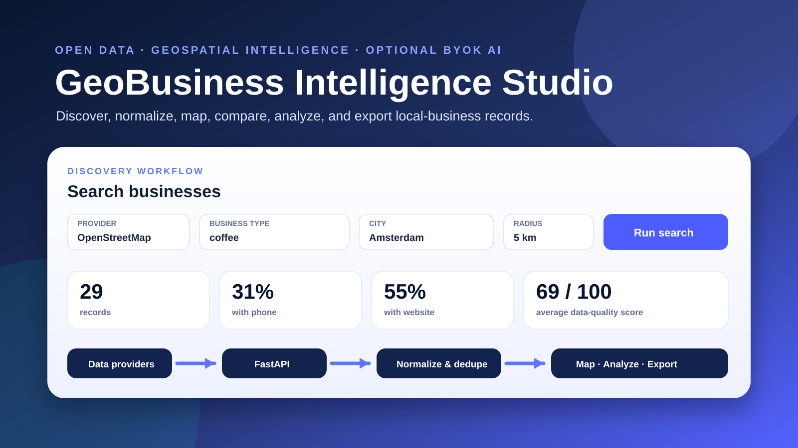
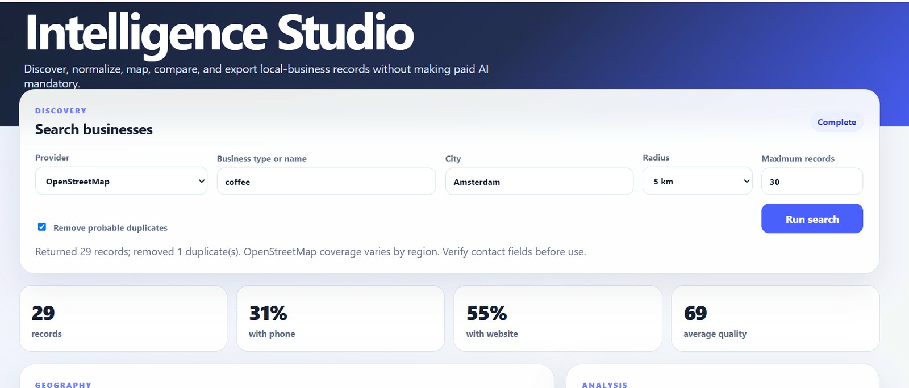

<div align="center">
  

# GeoBusiness Intelligence Studio

### An Open-Data Platform for Business Discovery, Mapping, Data Quality, and Optional BYOK AI

[](https://github.com/FaramarzKowsari/geo-business-intelligence-studio/actions/workflows/ci.yml)
[](https://github.com/FaramarzKowsari/geo-business-intelligence-studio/actions/workflows/deploy-pages.yml)
[](LICENSE)
[](https://www.python.org/)
[](https://fastapi.tiangolo.com/)
[](docs/ZENODO_RELEASE_GUIDE.md)

**Project site:** `https://FaramarzKowsari.github.io/geo-business-intelligence-studio/`

**Visual guidebook:** `https://FaramarzKowsari.github.io/geo-business-intelligence-studio/guidebook/`

**Source code:** `https://github.com/FaramarzKowsari/geo-business-intelligence-studio`

</div>

<p align="center">
  <a href="https://FaramarzKowsari.github.io/geo-business-intelligence-studio/" title="Open the GeoBusiness Intelligence Studio project site">
    
  </a>
</p>

<p align="center"><sub>Project architecture and interface overview · Click the image to open the public project site</sub></p>

---

GeoBusiness Intelligence Studio is a privacy-aware, portfolio-ready platform for discovering, normalizing, deduplicating, mapping, analyzing, and exporting local-business records. It works without any paid AI key in Sample mode and can query OpenStreetMap through Nominatim and Overpass. Google Places and AI enrichment are optional Bring Your Own Key integrations.

The repository intentionally separates **provider data**, **deterministic processing**, and **optional AI interpretation**. It does not scrape the Google Maps website, bypass CAPTCHAs, rotate identities, or evade access controls.

## Visual guidebook

<table>
<tr>
<td width="34%" align="center">
  <a href="https://FaramarzKowsari.github.io/geo-business-intelligence-studio/guidebook/">
    
  </a>
</td>
<td>

### Inside GeoBusiness Intelligence Studio

**A Visual Guide to Open Data, Geospatial Discovery, and Local Business Intelligence**

The ten-section guidebook explains the project purpose, provider architecture, workflow, interface, normalization, data-quality model, probable duplicate detection, privacy, optional AI, deployment, research value, citation preparation, and author information.

- [Read the guidebook](https://FaramarzKowsari.github.io/geo-business-intelligence-studio/guidebook/)
- [Open or download the PDF](https://FaramarzKowsari.github.io/geo-business-intelligence-studio/guidebook/inside-geobusiness-intelligence-studio.pdf)
- [View the PDF inside the repository](docs/guidebook/inside-geobusiness-intelligence-studio.pdf)
- [Guidebook documentation](docs/GUIDEBOOK.md)
- [Zenodo release guide](docs/ZENODO_RELEASE_GUIDE.md)
- [Google Search Console guide](docs/SEARCH_CONSOLE_GUIDE.md)

</td>
</tr>
</table>

## Canonical project links

- [GeoBusiness Intelligence Studio — public project site](https://faramarzkowsari.github.io/geo-business-intelligence-studio/)
- [GeoBusiness Intelligence Studio source code and technical documentation](https://github.com/FaramarzKowsari/geo-business-intelligence-studio)
- [Inside GeoBusiness Intelligence Studio — visual guidebook](https://faramarzkowsari.github.io/geo-business-intelligence-studio/guidebook/)
- [Inside GeoBusiness Intelligence Studio — direct PDF](https://faramarzkowsari.github.io/geo-business-intelligence-studio/guidebook/inside-geobusiness-intelligence-studio.pdf)
- [Continuous integration results](https://github.com/FaramarzKowsari/geo-business-intelligence-studio/actions)
- [Zenodo DOI release instructions](docs/ZENODO_RELEASE_GUIDE.md)

Use descriptive anchor text when linking to the project. Consistent titles help readers and search systems understand the destination.

## What it can do

- run immediately with fictional offline sample records;
- discover places through OpenStreetMap using Nominatim and Overpass;
- optionally query the official Google Places API (New);
- normalize provider-specific responses into a shared business model;
- preserve visible source provenance;
- calculate an interpretable data-completeness score;
- remove probable duplicates using phone equality and name/address similarity;
- visualize coordinates on a Leaflet map;
- export current results as CSV or JSON;
- generate a deterministic dataset briefing without AI;
- optionally use Ollama or an OpenAI-compatible BYOK endpoint;
- expose interactive OpenAPI documentation through FastAPI;
- run with Docker and verify code through GitHub Actions.

## Verified live OpenStreetMap search

<p align="center">
  
</p>

The demonstrated search returned 29 records after removing one probable duplicate. Phone coverage was 31%, website coverage was 55%, and the average completeness score was 69/100. Provider coverage varies by region, and contact data must be verified before use.

## Evidence and responsibility labels

| Layer | Meaning |
|---|---|
| **Provider record** | Data returned by Sample, OpenStreetMap, or the optional official Google Places adapter. |
| **Normalized record** | A provider response converted into the shared internal business schema. |
| **Quality score** | A completeness indicator, not proof that the business data is correct or current. |
| **Probable duplicate** | An inferred duplicate based on stronger and softer matching evidence. |
| **Deterministic briefing** | A built-in statistical summary generated without a model. |
| **AI analysis** | Optional interpretation from Ollama or an OpenAI-compatible endpoint; it is not source evidence. |

## Quick start — no API key

### Windows PowerShell

```powershell
Copy-Item .env.example .env
python -m venv .venv
.\.venv\Scripts\python.exe -m pip install -e ".[dev]"
.\.venv\Scripts\python.exe -m uvicorn app.main:app --reload
```

### macOS / Linux

```bash
cp .env.example .env
python3 -m venv .venv
source .venv/bin/activate
python -m pip install -e '.[dev]'
python -m uvicorn app.main:app --reload
```

Open:

- Dashboard: `http://127.0.0.1:8000`
- API documentation: `http://127.0.0.1:8000/docs`
- Health check: `http://127.0.0.1:8000/api/health`

Use provider **Sample data — offline** to test the complete application without network access.

## Docker

```bash
cp .env.example .env
docker compose up --build
```

Open `http://localhost:8000`.

## Providers

### OpenStreetMap

No API key is required. The application geocodes the city with Nominatim and retrieves matching objects with Overpass. Public services are shared infrastructure: use a truthful application identifier, keep traffic modest, cache in production, and operate dedicated infrastructure for sustained workloads.

```env
APP_CONTACT_EMAIL=https://github.com/FaramarzKowsari/geo-business-intelligence-studio
```

### Google Places API (New)

The optional adapter uses the official Places Text Search endpoint with the key owner's credentials.

```env
GOOGLE_PLACES_API_KEY=your_restricted_key
```

### Optional AI

AI is disabled by default.

Local Ollama:

```env
AI_PROVIDER=ollama
AI_MODEL=qwen3:4b
AI_BASE_URL=http://host.docker.internal:11434/v1
```

OpenAI-compatible provider:

```env
AI_PROVIDER=openai_compatible
AI_MODEL=your-model
AI_BASE_URL=https://your-provider.example/v1
AI_API_KEY=your_key
```

The core discovery, mapping, quality, deduplication, and export path does not depend on AI.

## API example

```bash
curl -X POST http://127.0.0.1:8000/api/search \
  -H "Content-Type: application/json" \
  -d '{
    "provider": "openstreetmap",
    "query": "coffee",
    "city": "Amsterdam",
    "radius_m": 5000,
    "limit": 30,
    "deduplicate": true
  }'
```

## Project structure

```text
geo-business-intelligence-studio/
├── app/
│   ├── main.py
│   ├── config.py
│   ├── models.py
│   ├── services.py
│   ├── exporters.py
│   ├── ai.py
│   ├── providers/
│   └── static/
├── docs/
│   ├── index.html
│   ├── guidebook/
│   ├── assets/
│   ├── sitemap.xml
│   ├── robots.txt
│   ├── llms.txt
│   ├── ARCHITECTURE.md
│   ├── RESPONSIBLE_USE.md
│   ├── GUIDEBOOK.md
│   ├── ZENODO_RELEASE_GUIDE.md
│   └── SEARCH_CONSOLE_GUIDE.md
├── tests/
├── .github/workflows/
│   ├── ci.yml
│   └── deploy-pages.yml
├── .zenodo.json
├── CITATION.cff
├── codemeta.json
├── Dockerfile
└── docker-compose.yml
```

## Technical and scholarly documentation

- [Architecture](docs/ARCHITECTURE.md)
- [Responsible use](docs/RESPONSIBLE_USE.md)
- [Security policy](SECURITY.md)
- [Guidebook](docs/GUIDEBOOK.md)
- [Zenodo DOI release guide](docs/ZENODO_RELEASE_GUIDE.md)
- [Google Search Console and discoverability](docs/SEARCH_CONSOLE_GUIDE.md)
- [Machine-readable summary](docs/llms.txt)

## Tests and continuous integration

```bash
python -m ruff check .
python -m pytest
```

The GitHub Actions matrix checks supported Python versions. The public Pages workflow publishes only static documentation; the FastAPI backend must run locally, in Docker, or on a Python-capable hosting service.

## Author

**Faramarz Kowsari** is an author, Software Engineer and AI researcher based in Istanbul. Focusing on the intersection of technology, education, and personal growth, he has published over 80 digital titles on international platforms. His areas of expertise span Artificial Intelligence, prompt engineering, modern trading strategies (Smart Money Concepts & algorithmic trading), as well as classical literature and mindfulness. In addition to writing, he develops web-based educational tools and creates specialized instructional video content.

### Official Profiles & Repositories

- ORCID: https://orcid.org/0000-0003-1692-0453
- Google Scholar: https://scholar.google.com/citations?user=G7tP5WMAAAAJ&hl=en
- GitHub: https://github.com/FaramarzKowsari
- LinkedIn: https://www.linkedin.com/in/faramarzkowsari
- Google Books: https://play.google.com/store/search?q=Faramarz_Kowsari&c=books
- Official Website: https://FaramarzKowsari.github.io
- Zenodo Records: https://zenodo.org/search?q=creators.orcid%3A%220000-0003-1692-0453%22&l=list&p=1&s=10&sort=bestmatch

## Citation

The repository is prepared for a version-specific Zenodo DOI. Until the first archived release is published, cite the source repository as:

> Kowsari, F. (2026). *GeoBusiness Intelligence Studio: An Open-Data Platform for Business Discovery, Mapping, Data Quality, and Optional BYOK AI* (Version 1.0.0) [Computer software]. GitHub. https://github.com/FaramarzKowsari/geo-business-intelligence-studio

After Zenodo mints the DOI, replace the GitHub-only citation with the DOI citation and update the DOI badge. Machine-readable metadata is available in [`CITATION.cff`](CITATION.cff), [`.zenodo.json`](.zenodo.json), and [`codemeta.json`](codemeta.json).

## License

MIT © 2026 Faramarz Kowsari.
